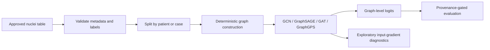

# F2 HistoGNN

Synthetic-first, leakage-aware nuclei-graph contracts for an exploratory LUAD/LUSC classification benchmark.

> **Verified boundary:** implementation and 62 synthetic/offline tests pass locally and on private Kaggle version 2. No real histopathology benchmark, clinical result, model checkpoint, or performance metric is claimed.

## Problem

Whole-slide pathology workflows can represent detected nuclei as spatial graphs, but an apparently successful experiment can still be invalidated by patient leakage, ambiguous labels, feature drift, or untraceable artifacts. This project makes those contracts executable before any restricted data or costly training is allowed.

## Architecture



Each nucleus is a node with exactly seven features: normalized `x`, normalized `y`, and five nucleus-type probabilities. Edges use graph-local spatial neighborhoods and one normalized distance feature. Batches must use contiguous graph IDs and cannot contain cross-graph edges. Models return one binary-classification logit row per graph after global pooling.

## Dataset boundary and leakage policy

No slide, patient record, restricted annotation, embedding, or model weight is included. Labels may be derived only from approved metadata with an exact, bijective `LUAD`/`LUSC` mapping. Patient/case groups are split before training, and the split contract rejects group overlap. A real-data run remains blocked until source, license, de-identification, checksum, schema, storage, retention, and output rules are approved.

## Installation

The source-only lock targets Python 3.11 and the versions tested locally:

```bash
python -m venv .venv
# Activate the environment, then:
python -m pip install -r requirements.txt
```

The lock contains only NumPy, PyTorch, PyTorch Geometric, and pytest. It intentionally excludes slide readers, datasets, tracking clients, and download helpers.

## Synthetic verification

```bash
python -m compileall -q data models explanations training tests
python -m pytest -q
```

Or run `scripts/verify_synthetic.ps1` on PowerShell / `scripts/verify_synthetic.sh` on POSIX shells.

Local planning-tree verification on 2026-09-07: **62 passed, 3 warnings, exit 0** in 13.17 seconds. Final standalone public-export verification on 2026-09-08: **62 passed, 3 warnings, exit 0** in 19.15 seconds. Both used Python 3.11.9, NumPy 2.4.6, PyTorch 2.12.1+cpu, PyTorch Geometric 2.7.0, and pytest 9.0.3. The warnings are one PyG distributed deprecation and two `torch.jit.script` deprecations. These are synthetic contract tests, not histology results.

## Kaggle execution

Follow [`notebooks/KAGGLE_RUNBOOK_07-f2-histognn.md`](notebooks/KAGGLE_RUNBOOK_07-f2-histognn.md) and execute the notebook one gate at a time. Private kernel `ajinkya1225/07-f2-histognn`, version 2, completed on 2026-09-08: **62 passed, 3 warnings, exit 0** in 15.01 seconds on CPU. It used Python 3.12.13, NumPy 2.4.6, PyTorch 2.12.1, PyTorch Geometric 2.7.0, and pytest 9.0.3. The PyTorch build reported CUDA 13.0, but CUDA was unavailable at runtime with zero visible GPUs; no GPU training ran. Version 1 remains a documented source-staging failure.

## Verification states

| Capability | State |
|---|---|
| Graph, label, split, batching, model, training, and explanation contracts | Implemented and locally verified on synthetic fixtures |
| Determinism and patient/case-disjoint split assertions | Locally verified on synthetic fixtures |
| Kaggle source-only run | Version 2 completed and verified |
| Kaggle synthetic graph smoke | Verified through 62 synthetic contract tests on CPU |
| Real-data reader and artifact provenance | Blocked |
| Real LUAD/LUSC benchmark and metrics | Not verified |
| GPU training or performance | Not run / not verified |
| Deployment or clinical use | Out of scope / not verified |

## Metrics and reproducibility

Future classification reporting should define accuracy, macro-F1, AUROC, and AUPRC from graph-level predictions, with class counts and the positive-class convention stated. No number may be published without dataset/version, license, split hash, patient-disjointness evidence, seed, device, dependency lock, code revision, and artifact hashes. Class-imbalance policy remains a real-data decision because class counts are not yet known.

## Privacy and security

- Synthetic tests require no real slide or network service.
- Missing CUDA is reported explicitly; there is no silent device fallback.
- GraphGPS fails explicitly when its required GINE implementation is unavailable.
- Explanations are exploratory sensitivity diagnostics, not causal or clinical evidence.
- Secrets, raw data, weights, checkpoints, and private execution evidence are excluded from the public export.

## Limitations

The repository is a benchmark scaffold, not a completed scientific study. It has no approved real dataset, real nuclei-extraction pipeline, external validation cohort, calibrated uncertainty analysis, model-selection result, or clinical evaluation. The generic top-level package names are retained for compatibility and may conflict in unusually crowded Python environments.

## Roadmap

1. Approve and hash an appropriately licensed, de-identified nuclei artifact.
2. Implement the bounded real-data reader and preflight report.
3. Verify patient/slide-disjoint real-data splits and run the smallest approved benchmark.
4. Report metrics only with complete provenance and uncertainty methodology.

See [`DESIGN.md`](DESIGN.md), [`CITATIONS.md`](CITATIONS.md), and [`THIRD_PARTY_NOTICES.md`](THIRD_PARTY_NOTICES.md) for contracts and attribution.

## License

Released under the [MIT License](LICENSE).
